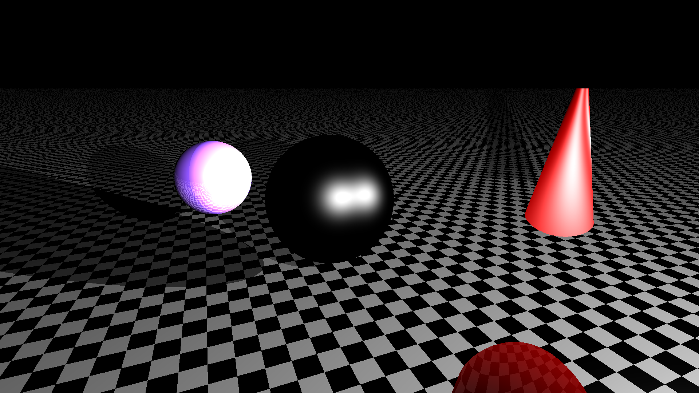

# Global-Illumination-Building-a-RayTracer

## Checkpoint 6
-  Make one sphere transparent (kt = 0.8)
-  Make other sphere non-transparent
-  Extra attempted

For extra point:
- Adjust shadow ray based upon transparency of objects.

## Checkpoint 5
- Make one sphere reflective (kr ¹ 0.0)
- Make other sphere non-reflective (kr = 0.0)
- Make the floor non-reflective (kr = 0.0)
- Make all objects non-transparent (kt = 0.0)

#### Screenshots

## Checkpoint 4
Extras
- Implement another procedural shader or texture (your
choice)

#### Screenshots

## Checkpoint 3
Extras
- Add support for multiple light sources
- Phong-Blinn
- supersampling

#### Screenshots

## Checkpoint 2
- Bonus :Add another object type to your scene
    - E.g. cone, torus, cylinder
 

#### Screenshots

## Checkpoint 1
- This scene has 3 objects:
    - 2 spheres
    - 1 floor
    - In addition,
    - 1 point light source
- Finally,
    - Rendered from a given viewpoint.

### Goal
- Obtain locations / orientations / attributes of objects in scene
    -  Sphere 1 : position = Point(-1f, 1.0f, 0f), radius = 0.6f
    -  Sphere 2 : position = Point(-2f, 1.3f, 0f), radius = 0.3f
    -  Plane : position = origin, normal: y 
- Obtain position / parameters of light source
    -  Point(2f, 2f, 4f)
- Obtain position / parameters of camera
    -  position = Point(-2f, 2f, 3f), lookAt = Point(-0.8f, 1f, 0f).  
 

#### Screenshots

